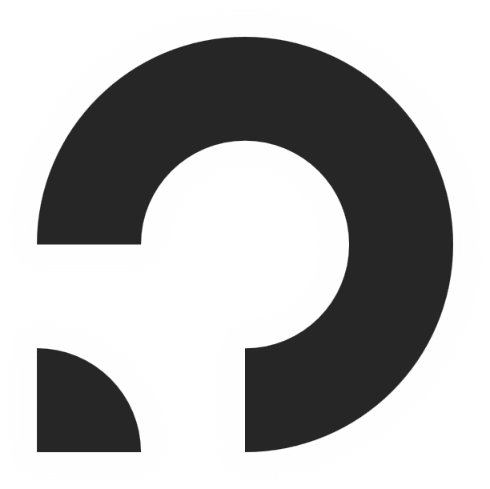

## I'm Phoenix226 👋
- 🧑‍💻 Developer
- 🛠️ GD player and creator
- 📓 Studying at SP
- ❓ Feel free to ask me anything about Python! :)

## What I do
| Frontend | Backend |
| ----------- | ----------- |
|  |  |

<!--
**Phoenix226gd/phoenix226gd** is a ✨ _special_ ✨ repository because its `README.md` (this file) appears on your GitHub profile.

Here are some ideas to get you started:

- 🔭 I’m currently working on ...
- 🌱 I’m currently learning ...
- 👯 I’m looking to collaborate on ...
- 🤔 I’m looking for help with ...
- 💬 Ask me about ...
- 📫 How to reach me: ...
- 😄 Pronouns: ...
- ⚡ Fun fact: ...
-->
